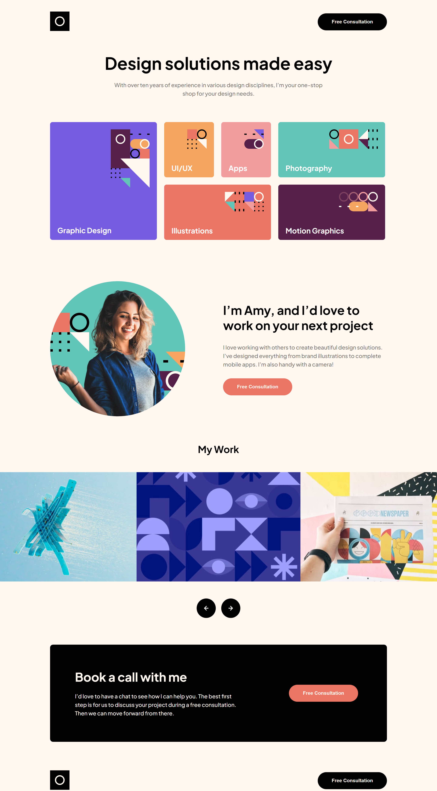

## The challenge

Users should be able to:

- View the optimal layout for the site depending on their device's screen size
- See hover states for all interactive elements on the page
- Navigate the slider using either their mouse/trackpad or keyboard

### Screenshot

### Links

- Live Site URL: [Single Page Design Portfolio](https://single-page-design-rosy.vercel.app/)

## My process

The project took me about 8 hours to complete. It is responsive - desktop, tablet and mobile versions. A new task I had to deal with was the layout of the grid in different compositions in each view, but I completed it without any problems.

### Built with

- HTML
- CSS 
- SCSS
- Flexbox
- ReactJS

